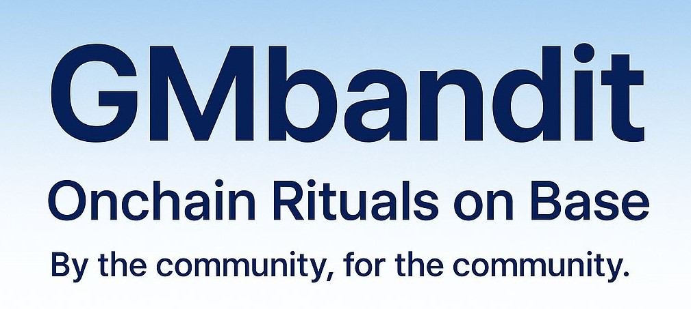

---

## 🟦 Feature


* ✅ Onchain `gm()`, `gn()`, and `gosleep()` functions
* 💸 Flat ritual fee: **0.00000033 ETH** (~$0.001)
* 💰 Fees go directly to the collector wallet
* 📊 All rituals are public and verifiable on Base
* 📱 Minimal, fun UI (Vercel-hosted)
* 🧠 Future plan: Farcaster integration for social vibes

---

## 🧩 Architecture


User → Base App (Frontend) → GMbandit.sol → Collector Wallet → [Farcaster](https://farcaster.xyz/banditi) (Social Layer)


A simple ritual flow that keeps the community connected onchain.

---

## 🛠️ Stack

* **Solidity** + **Hardhat**
* **Ethers.js**
* **Base L2**
* **Vercel** (Frontend Hosting)
* **MIT License**

---

## 🚀 Getting Started

1. Clone this repo

   ```bash
   git clone https://github.com/beny25/GMbandit.git
   cd GMbandit
   ```
2. Install dependencies

   ```bash
   npm install
   ```
3. Compile and deploy the contract

   ```bash
   npx hardhat compile
   npx hardhat run scripts/deploy.js --network base
   ```
4. Connect your wallet to Base and test your ritual ⏹

---

## 🔗 Deployed Contract

The GMbandit contract is live and verified on Base Mainnet:

Contract Address:  
[0x499b504563C08A661a0c6e1387eb4FB551C362F5](https://basescan.org/address/0x499b504563C08A661a0c6e1387eb4FB551C362F5)

Owner Address (Controller):  
[0x4ae70118dd2cb814404daaa064dab470b7f76542](https://basescan.org/address/0x4ae70118dd2cb814404daaa064dab470b7f76542)

This contract is fully verified.  
Feel free to inspect, fork, or vibe.

---
## 💬 Philosophy

> “Not everything onchain needs to be serious.
> Sometimes, it just needs to be consistent.”

Built to make the Base ecosystem more human 
**one GM, one GN, one vibe at a time.**

---

## 🧠 License

MIT License © [Bandit.base.eth](https://x.com/Alidepok1/status/1986283176994742426)
